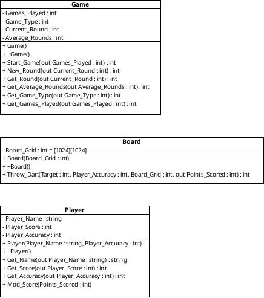

# Darts 301 Pseudocode:

### `Player.Mod_Score(int Points_Scored)`
```
if current score > points scored:
    current score - points scored
    return
else if current score < points scored:
    return
```

### `Game.Game()`
```
get game type (301 or 501)
current round = 0
average rounds = 0
games played = 0
return
```

### `Game.Start_Game()`
```
average round + current round / games played
games played + 1
current round = 0
return
```

### `Game.New_Round()`
```
current round + 1
return
```

### `Board.Board()`
```
Init board grid as 1024x1024 in array - all = 0
map dart board:
    get game type - in 301 mark all spaces which would be \
                        double or triple as std
    
    mark out values - 
        set area of cord grid = score, i.e:
            bullseye coords all set = 50, 
            17 sector coords set to 17
        as above set double or triple = std if game type = 301
```

### `Board.Throw_Dart`
```
get target sector
roll random number against player accuracy to determine actual hit location:
    aim for center of sector deviating by accuracy:
        simulate throw from 2m, accounting for gravitational drop
        determine spread cone
        place hit within cone:
            if hit roll beats accuracy:
                land in target
                add target value to points scored
            else:
                select hit sector based on the largest sector in hit cone
                add sector value to points scored
```

# Darts 301 UML:
